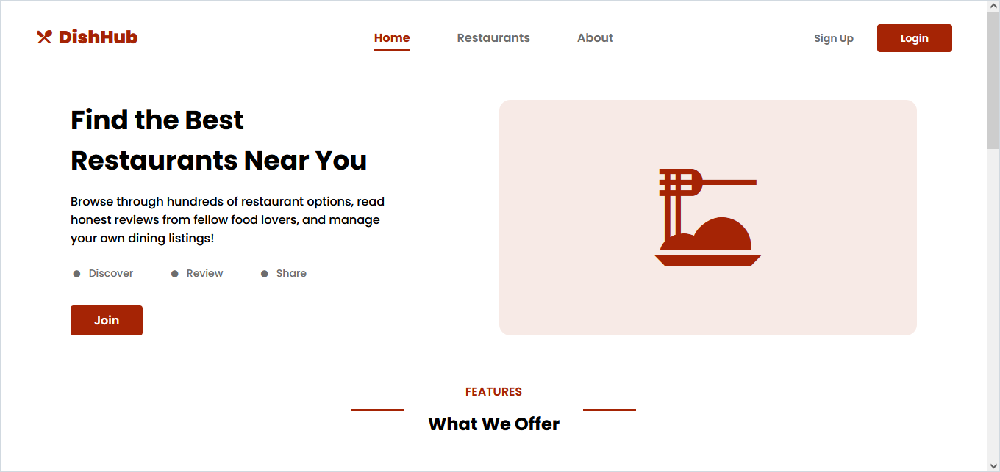
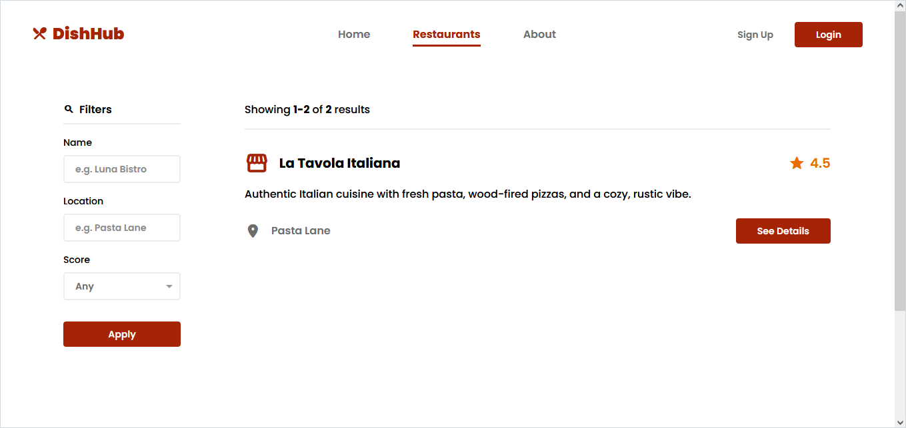
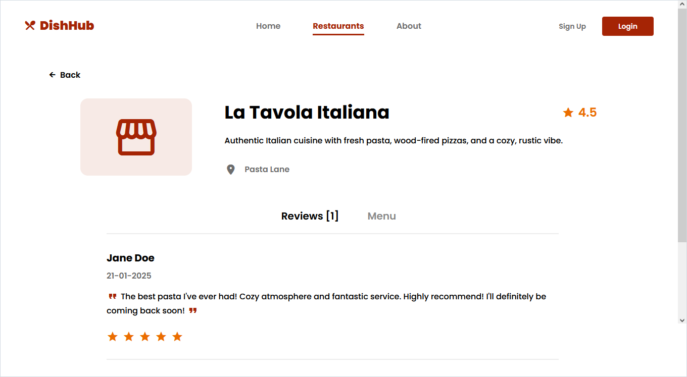

<h1 align="center">
    
</h1>

* [About](#-hexemoji)
* [Tech Stack](#tech-stack)
* [Features](#features)
* [Showcase](#showcase)
* [License](#license)

# 🍽️ DishHub

DishHub is a website for restaurant reviews and promotion. The system allows users to sign up, promote their own restaurants, and post reviews about other establishments.

The application was developed as part of a practical project for the Software Engineering course offered by [University of Brasília](https://www.unb.br/) during the 2024/2 semester.

# Tech Stack

* [Angular](https://angular.dev/) + [Standalone Components](https://angular.dev/guide/components) on the frontend.
* [ASP.NET Core](https://dotnet.microsoft.com/apps/aspnet) on the backend.
* [PostgreSQL](https://www.postgresql.org/) + [EF Core](https://learn.microsoft.com/en-us/ef/core/) for the database.
* [ASP.NET Identity](https://learn.microsoft.com/en-us/aspnet/core/security/authentication/identity) for authentication and authorization (web cookies).

# Features 

* **User Registration:** Users can sign up for the system to manage their restaurants, menus, and reviews.
* **Restaurant Management:** Users can register and manage information about their establishments, including details such as name, description, and location.
* **Menu Management:** Users can add and manage menu items for their restaurants, listing the available dishes.
* **Review System:** Users can post reviews and rate restaurants they’ve visited based on their experience.

# Showcase

<h1 align="center">
    
    
    
</h1>

# License

This project is distributed under the MIT License. Check the [LICENSE](https://github.com/enzzoMs/DishHub/blob/main/LICENSE) file for more details.
